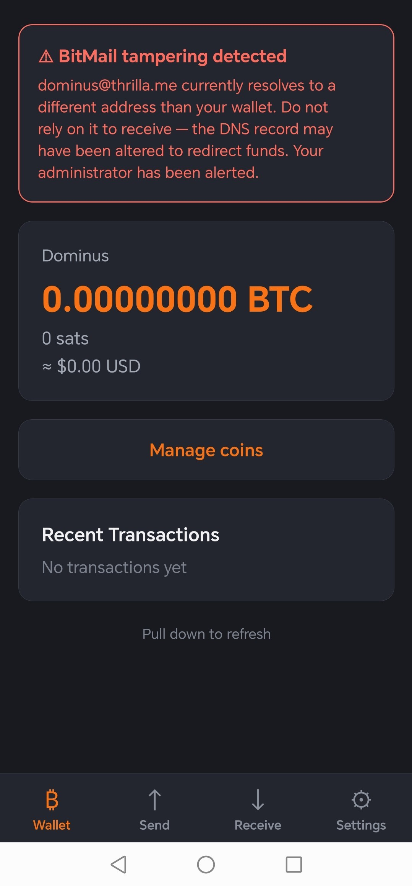
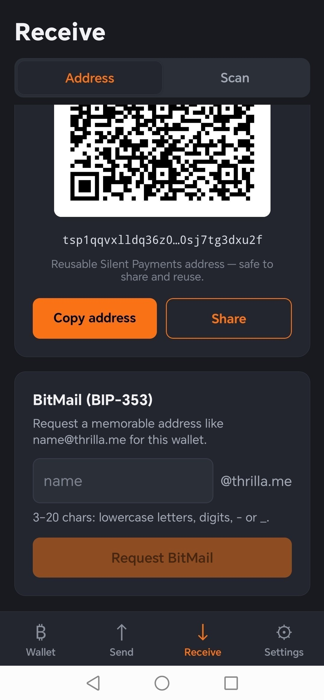
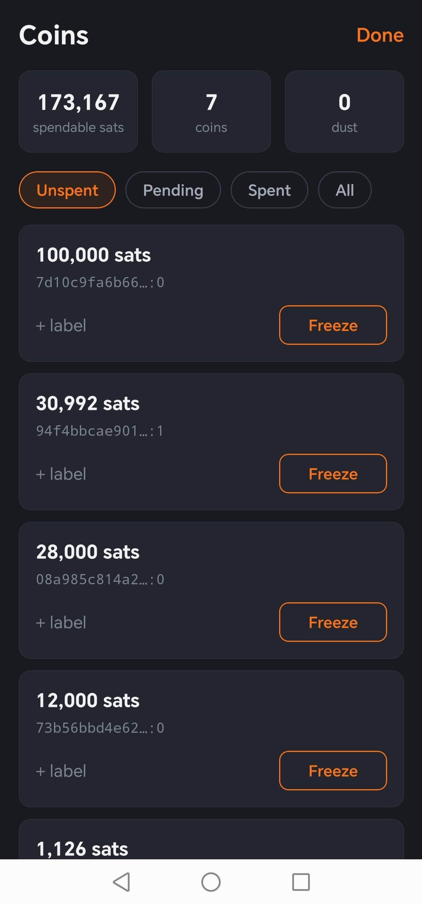
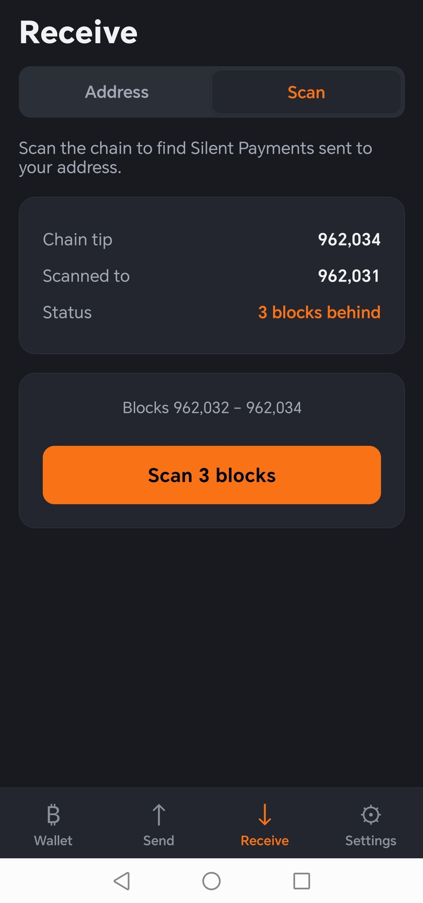

# Thrilla — Bitcoin Silent Payments Wallet

Thrilla is a self-custodial **Bitcoin** wallet built on **Silent Payments
([BIP-352](https://github.com/bitcoin/bips/blob/master/bip-0352.mediawiki))**.
It's a React Native (Android/iOS) app; a Vue web app lives in the same repo.

## What is it for?

Silent Payments let you publish **one reusable address** and receive to it as
many times as you like — **without reusing an address on-chain**. Each payment
the sender makes derives a fresh, unlinkable output, so your incoming payments
can't be tied together by a static address on the blockchain. You get the
convenience of a single "always-on" address with much better privacy than a
normal reused address, and without running an interactive server to hand out
fresh addresses.

- **Reusable, shareable address.** Publish your `sp1…` address (QR, link, or a
  memorable **BitMail** name like `you@thrilla.me` via
  [BIP-353](https://github.com/bitcoin/bips/blob/master/bip-0353.mediawiki)).
- **Self-custodial.** Keys are derived **on-device** from a BIP-39 seed at the
  BIP-352 path (`m/352'`). Your **spend key never leaves the phone**. The scan
  key is only uploaded if you opt into **background scanning** — and it can
  *detect* payments but can never spend them.
- **Real Bitcoin, on-chain.** Your coins are ordinary UTXOs on the Bitcoin
  blockchain, spendable to Silent Payment, on-chain (`bc1…`), or BitMail
  recipients. The backend only stores *references* to your scanned UTXOs; the
  bitcoin itself always lives on-chain and is recoverable from your seed.
- **Coin control & privacy tools.** See, label, and **freeze** individual
  coins; dust from third parties is flagged so you can avoid it.
- **Notifications.** Get a push when a payment arrives (even with the app
  closed) via an opt-in background scanner — the amount is shown in-app, not to
  the push provider.
- **Lock & duress.** Biometric or in-app PIN lock, plus an optional **duress
  PIN** that wipes this device's keys and signs out. Sending re-authenticates.

Thrilla talks to a self-hosted **LNbits** instance running the **siLNt**
extension (the scanner/indexer backend). Builds are provided for **mainnet** and
**signet**.

## Screenshots

<table>
  <tr>
    <td align="center">
      <br>
      <sub><b>Wallet</b> — balance & history</sub>
    </td>
    <td align="center">
      <br>
      <sub><b>Receive</b> — reusable address & BitMail</sub>
    </td>
    <td align="center">
      <br>
      <sub><b>Coins</b> — coin control & freeze</sub>
    </td>
    <td align="center">
      <br>
      <sub><b>Scan</b> — find Silent Payments</sub>
    </td>
  </tr>
</table>

## Quick Start

### Prerequisites

- Node.js 16+
- Android SDK (for Android development)
- Xcode (for iOS development on macOS)

### Setup

```bash
npm install
```

### Development

**Start Metro bundler:**
```bash
npm start
```

**Run on Android (in another terminal):**
```bash
npm run android          # mainnet debug
npm run android:signet   # signet debug
```

**Run on iOS (macOS only):**
```bash
npm run ios
```

### Build a release APK

The app has `mainnet` and `signet` build flavors (each pulls its own `.env`):

```bash
npm run apk:mainnet   # → android/app/build/outputs/apk/mainnet/release/
npm run apk:signet    # → android/app/build/outputs/apk/signet/release/
```

**Signing:** release builds are signed with your own keystore when its
credentials are present as Gradle properties (kept **outside** the repo, in
`~/.gradle/gradle.properties`):

```properties
THRILLA_STORE_FILE=/absolute/path/to/thrilla-release.keystore
THRILLA_KEY_ALIAS=thrilla
THRILLA_STORE_PASSWORD=…
THRILLA_KEY_PASSWORD=…
```

Generate the keystore once with:
```bash
keytool -genkeypair -v -keystore thrilla-release.keystore \
        -alias thrilla -keyalg RSA -keysize 4096 -validity 10000
```
Without those properties, release builds fall back to the debug key (fine for
local testing, never for distribution). **Back up the keystore + passwords** —
losing them means you can't ship updates.

## Project Structure

```
src/
├── App.tsx           # Root component
├── screens/          # Wallet, Send, Receive, Scan, Coins, Settings, Lock, …
├── components/       # Modals, PIN pad, seed input, QR, …
├── services/         # spKeys (BIP-352 derivation), api, secureKeys, push, …
├── stores/           # Zustand (mobile) / Pinia (web) state
└── views/            # Vue web app screens
index.js              # Entry point (polyfills, FCM background handler)
```

## Troubleshooting

**Metro cache issues:**
```bash
npm start -- --reset-cache
```

**Android build issues:**
```bash
cd android
./gradlew clean
./gradlew assembleDebug
```

**Pod issues (iOS):**
```bash
cd ios
rm -rf Pods Podfile.lock
pod install
```
